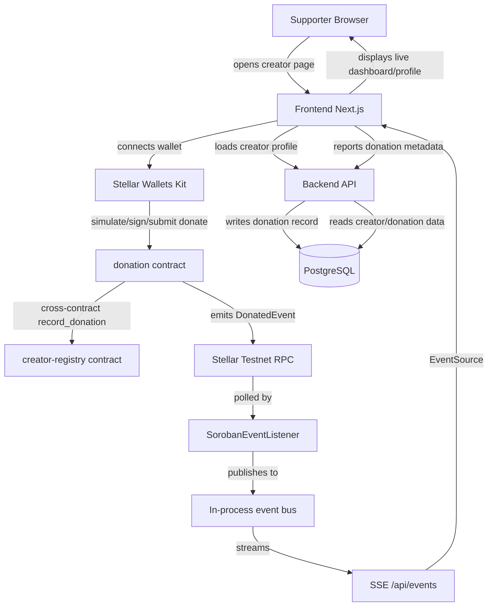
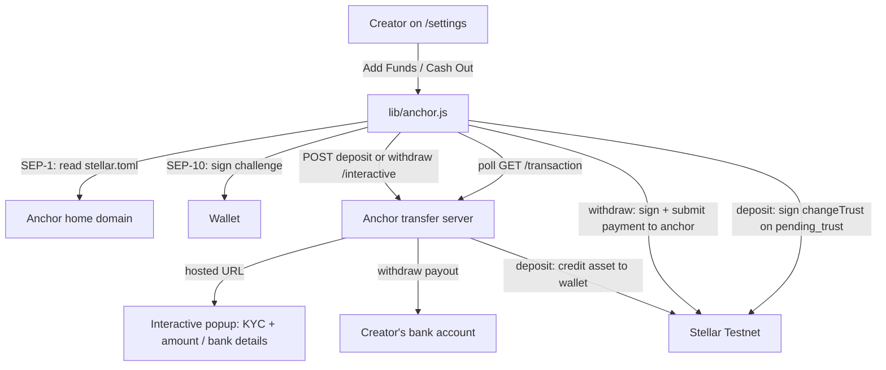

# SupportMe Architecture

SupportMe is a Stellar/Soroban-based creator donation platform with three
layers: on-chain smart contracts that settle and record donations, a
Node/Express backend that owns off-chain profile data and streams real-time
updates, and a Next.js frontend that ties wallets, contracts, and the API
together.

## Architecture Overview

- **Smart Contracts**: `contracts/`
  - `donation` and `creator-registry` are two independently deployed Soroban
    contracts on Stellar Testnet that talk to each other exclusively through
    cross-contract calls (`env.invoke_contract`).
  - `donation` moves XLM from donor to creator via the native Stellar Asset
    Contract, keeps an append-only on-chain donation log, and reports every
    settled donation to `creator-registry`.
  - `creator-registry` owns creator profile state (username, lifetime
    totals) and only accepts `record_donation` calls from the `donation`
    contract address it was initialized with.
  - Both contracts have unit test coverage (`cargo test --workspace`) using
    `soroban-sdk`'s `testutils`, including cross-contract integration tests
    that register a real `creator-registry` instance in a shared test `Env`.

- **Frontend**: `frontend/`
  - Next.js (App Router) app for the landing page, creator profile pages,
    the donation flow, and the creator dashboard/settings.
  - Connects wallets (Freighter, xBull, Albedo, Rabet, Lobstr) via Stellar
    Wallets Kit, and calls the `donation` contract directly
    (`lib/contract.js`: simulate → sign → submit → poll for confirmation).
  - Supports multiple donation assets (XLM + USDC) via a client-side asset
    registry (`lib/assets.js`) that resolves each asset's Stellar Asset
    Contract id for the `donation` contract's generic `token` parameter — no
    contract change required.
  - Integrates a Stellar **anchor** for fiat cash-out (`lib/anchor.js`): the
    full SEP-24 interactive withdraw flow (SEP-10 auth → `/info` → interactive
    popup → status polling → on-chain payment to the anchor), wired into
    `/settings`. Defaults to the SDF reference anchor on testnet.
  - Subscribes to the backend's SSE stream (`EventSource`) on the dashboard
    and public profile pages so new donations appear live without polling.
  - Tested with Vitest + React Testing Library (components, `AuthContext`,
    and the dashboard page's data/SSE behavior).

- **Backend**: `backend/`
  - Node.js + Express API, Prisma ORM, PostgreSQL.
  - Owns everything the contracts don't: user accounts, creator profiles,
    wallet-signature-based auth (JWT), and a denormalized donation history
    used for dashboard queries/stats.
  - Polls the Soroban RPC for `donation` contract events
    (`services/sorobanEventListener.ts`) and republishes them on an
    in-process event bus, which `routes/events.ts` streams to connected
    clients over Server-Sent Events.
  - Centralized error handling (`errors/`, `middleware/errorHandler.ts`) and
    Zod-based request validation (`middleware/validate.ts`, `schemas/`).
  - Tested with Jest + Supertest; Prisma is mocked in tests so the suite
    never touches a real database.

- **Database**: PostgreSQL
  - Stores `User`, `Creator`, and `Donation` records (see README for the
    schema). Compatible with any PostgreSQL-compatible host (the deployed
    instance runs on Railway).

- **CI**: `.github/workflows/ci.yml`
  - Three independent GitHub Actions jobs run on every push/PR to `main`:
    contracts (`cargo test` + a release `wasm32v1-none` build), backend
    (`tsc`/Prisma generate + `jest`), and frontend (`tsc` + `vitest` +
    `next build`).

## Flow Diagram

## Key Responsibilities

- **Contracts**
  - Settle donations atomically and trustlessly on-chain (no custody by the
    backend).
  - Keep the source of truth for lifetime creator totals via
    `creator-registry`, independent of the off-chain database.

- **Frontend**
  - Manage wallet sessions, build/sign/submit the `donate` contract
    invocation, and show live transaction status.
  - Send donation metadata to the backend after a successful on-chain
    transfer, and subscribe to SSE for real-time updates from other
    supporters.
  - Provide skeleton loading states and a root error boundary
    (`app/error.tsx`) for a resilient UX while data is loading or a render
    fails unexpectedly.

- **Backend**
  - Authenticate users via a signed wallet challenge (no passwords) and
    issue JWTs.
  - Store creator profile data and donation history for fast dashboard
    queries (avoiding a full-ledger scan for every page load).
  - Bridge on-chain activity to connected clients in real time via the
    Soroban event listener + SSE endpoint.
  - Validate all mutating requests with Zod schemas and return consistent
    error shapes via centralized error-handling middleware.

## Anchor / Fiat Flow (SEP-24 deposit & withdraw)

On testnet this points at the SDF reference anchor (`testanchor.stellar.org`,
asset `SRT`) — no signup, cost, or partnership. The same code targets a real
NGN anchor on mainnet by changing `NEXT_PUBLIC_ANCHOR_*` env vars.

Both SEP-24 legs are implemented in `lib/anchor.js`: **withdraw** (`runWithdraw`,
signs an on-chain payment to the anchor) and **deposit** (`runDeposit`, adds a
trustline when the anchor parks at `pending_trust`, then lets the anchor credit
the asset). Path-payment auto-settlement (tip in one asset → payout in another)
remains out of scope, documented in [PRD(v3)](../PRD(v3).md).

**Auth limitation:** only SEP-10 is implemented, which covers classic (`G...`)
and muxed (`M...`) accounts. Contract accounts (`C...`, smart wallets) would
require SEP-45 (Soroban authorization entries verified via RPC), which is not
implemented — sufficient for the Freighter `G...` account used on testnet.

## Contribution Focus Areas

- Add pagination and filtering for dashboards and donation history
- Add integration/e2e tests that exercise the full donate flow against a
  local Stellar network (e.g. `stellar-cli`'s local sandbox)
- Add a Railway/production deploy step to the CI workflow, gated on the
  existing test jobs
- Add SEP-24 **deposit** (fan fiat on-ramp) and path-payment settlement so a
  tip in one asset lands in the creator's preferred payout asset
- Add embeddable donation widgets for creators to use on other sites
